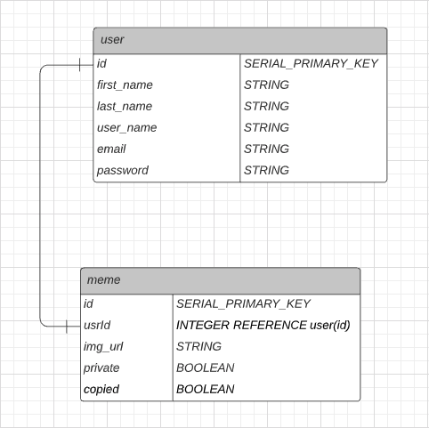

# Meme Bank

[Click here to visit Meme Bank](https://my-meme-bank.herokuapp.com/)

## Table of contents

- [General Info](general-info)
- [Setup](#setup)
- [Technologies](#technologies)
- [CRUD](#crud)
- [Initial Wireframe](#initial-wireframe)
- [ERD](#erd)
- [Status](#status)
- [Future Considerations](#future-considerations)

### General Info

For my unit-2 project in General Assembly's SEI course, I created a Meme Bank app.
Create and store your favorite memes for easy access whenever you need them.
Recently created memes will show up on the homepage.
You'll have the option to make your created memes private, so they wont show up on the homepage.
Add memes from the homepage to your bank.
If you no longer like a certain meme in your bank, you have the option to delete it.

### Setup

1. _`Fork`_ and _`Clone`_ this respository to your local machine
2. Open the directory in your text editor of choice to view or edit the code
3. Install dependencies and set up your database to work in your local port

### Technologies

This project was created using:

- HTML
- Javascript
- CSS
  - Bootstrap
- NodeJS
- Express
- Postgres

### CRUD
| VERB | URL | Action \(CRUD\) | Description |
| :--- | :--- | :--- | :--- |
| GET | / | index \(Read\) | Shows recently created memes |
| POST | /signup | Create \(Create\) | SignUp page |
| GET | /login | Read \(Read\) | SignUp page |
| GET | /bank | Read \(Read\) | Show your saved memes |
| GET | /meme | Read \(Read\) | shows a form to make a new meme |
| POST | /meme | Create \(Create\) | creates a meme with the POST payload data |
| POST | /bank/private | Update \(Update\) | Sets meme to private |
| POST | /bank/public | Update \(Update\) | Sets meme to public |
| DELETE | /bank | Destroy \(Delete\) | deletes the meme selected on screen |

### Initial Wireframe

### ERD

### Status

Completed & live on Heroku

### FUTURE CONSIDERATIONS

1. Add up-vote and down-vote capabilities
2. Upload your own images to create memes
3. Add capability to share to social media sites