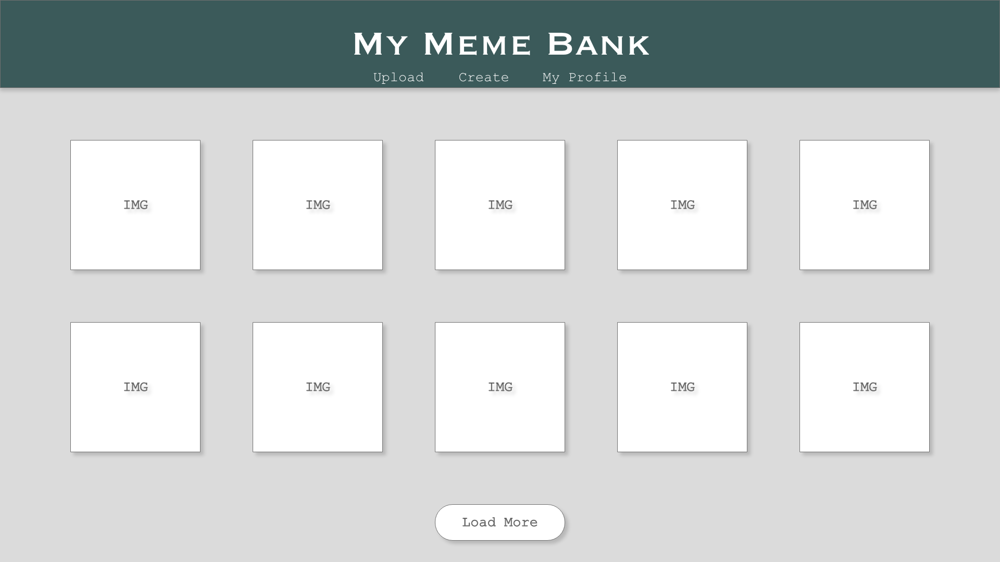
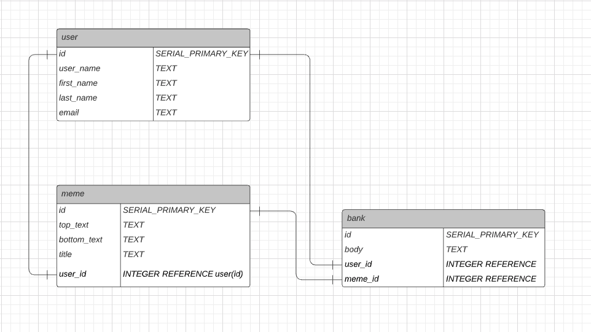

# Proposal
Requirements for the weekend

`1` An application name / concept 
- Meme Bank: Save and share your favorite memes. Create memes buy uploading images and adding text.

`2` A repo for your project 2 (built from express_auth template)
- Created during Fridays example

`3` Wireframe for your app - (Lucidchart)

`4` An ERD with two models (minimum) > User + 1 Resource (one to many) - (Lucidchart)

`5` Create (3-5) User Stories for the base user experience - ( [Reference](https://revelry.co/resources/development/user-stories-that-dont-suck/) )
- As a user when I go to the site, I want to be able to log on, so I can view my saved/created memes
- As a user when I scroll through my memes, I want to be able to view my memes, so I can share them on social media sites
- As a user when I'm in my meme bank, I want to be able to create/upload memes, so that I can expand my collection

`6` Resource's Restful Routing table ( [Readme](https://romebell.gitbook.io/sei-412/node-express/00readme-1/01intro-to-express/00readme#restful-routing) )

`7` Find API and test to see if you can get data ( *be able to print data in the console using Axios, Node-Fetch, and/or Postman* )